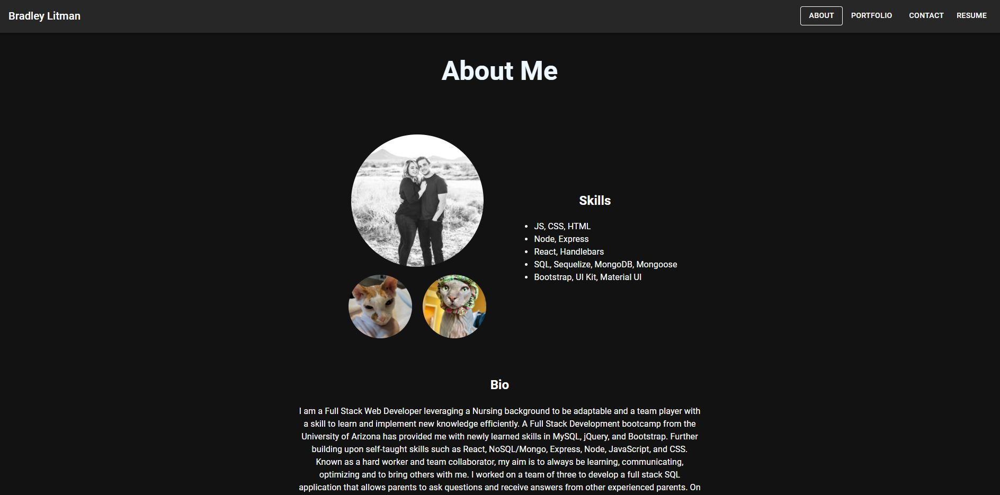

# Brad Litman`s React Portfolio
 

## Description
React created SPA showcasing my ability to use react. Examples of prior projects listed as well. 

## Table of Contents
* [Installation](#installation)
* [Usage](#usage)
* [Questions](#questions)

## Installation
Clone the repo, install dependencies and then run "npm start" to initialize the server. 

## Usage
Clone the repo, download the dependencies and then run the server/node files.
[Link](https://blitman12.github.io/react-portfolio/)

## Questions
Please visit my [GitHub profile](https://github.com/blitman12) for other cool projects
If you have any remaining questions please feel free to reach me at bradlitman94@gmail.com
